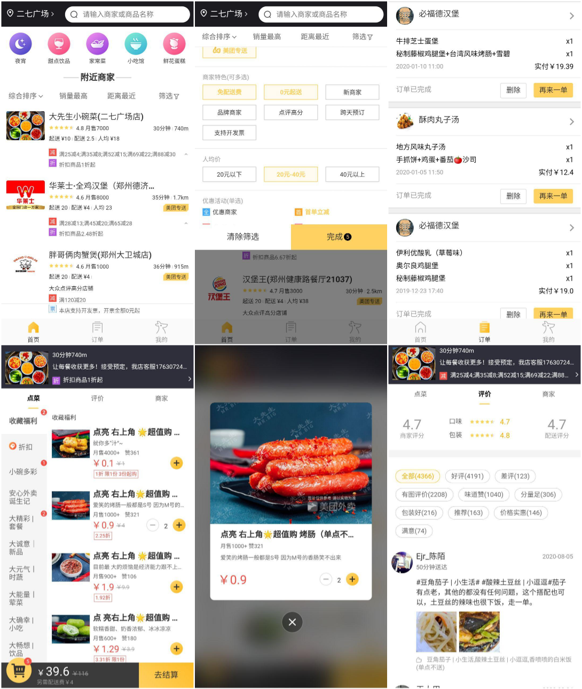

## :black_nib:简介

使用`typescript`+`hooks`+`dva`构建的美团外卖 webapp。

## [在线地址](http://seekinglight.gitee.io/web-take-away)

## :warning:声明

数据 mock 自美团官网，订单页面为本人数据。

本项目遵循`WTFPL`协议，仅作为学习交流使用，不用做任何商业用途。

JUST FOR FUN :stuck_out_tongue_closed_eyes:

## :camera:截图



## :memo:技术栈

- 类型检查： `Typescript 3.9`
- 前端框架： `React(Hooks) 16.9`
- 状态管理： `dva-core-ts 2.0`
- 前端路由： `react-router 5.2`
- 构建工具： `webpack 4.43`
- 图片优化： `react-lazy-load-image-component 1.5`
- 网络请求： `axios 0.19`

## :open_file_folder:目录大致结构

```
|-- web-takeaway
|-- build: `webpack配置`
|-- dev：`开发模式下的output`
|-- dist：`生产模式下的output`
|-- raw
|-- src
|  -- httpConfig.ts
|  -- Models: `dva数据模型`
|  -- components: `公共组件`
|  -- pages: `页面目录`
|    -- detail: `商家详情页面`
|    -- index: `首页`
|  -- utils: `封装的util`
|    -- homeUtils.ts
|    -- hooks.ts
```
